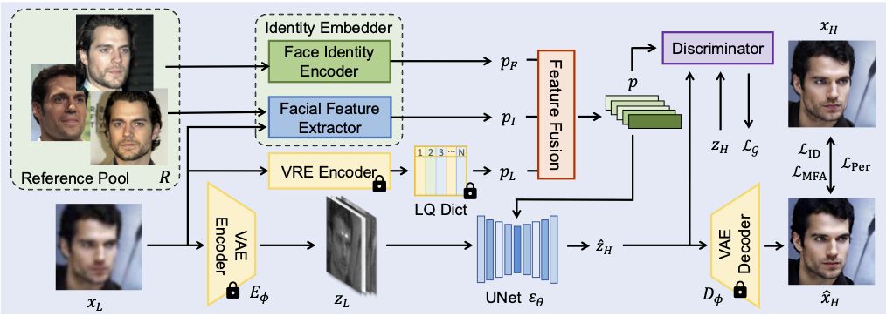
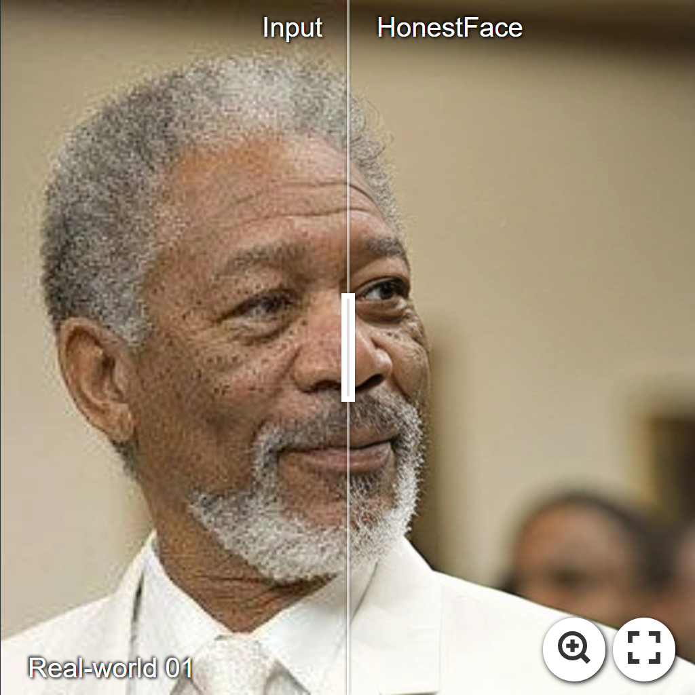
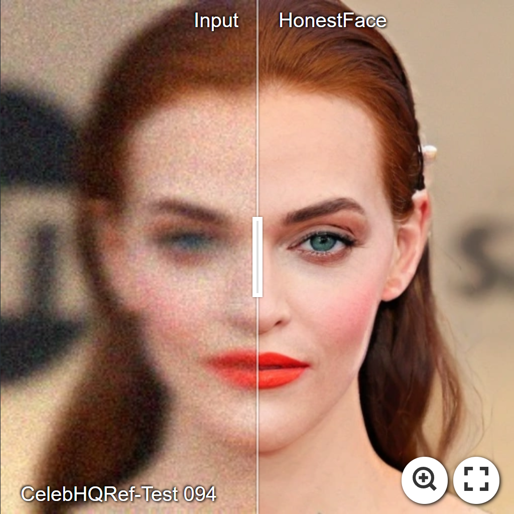
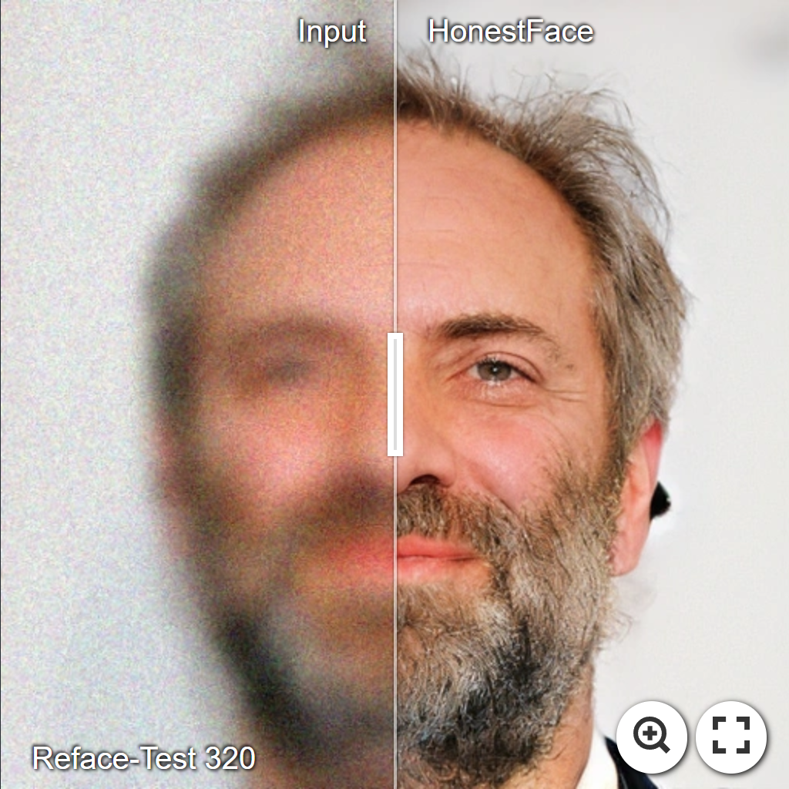
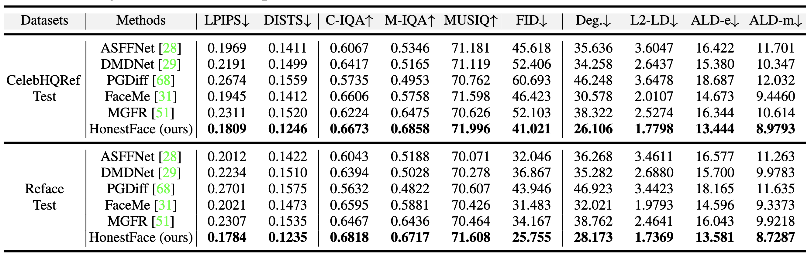
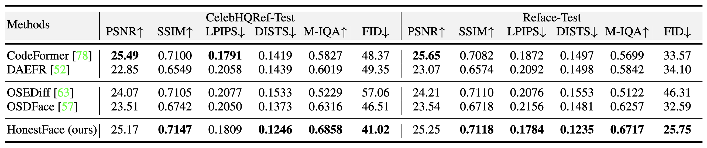

# HonestFace: Towards Honest Face Restoration with One-Step Diffusion Model

[Jingkai Wang](https://github.com/jkwang28), Wu Miao, [Jue Gong](https://github.com/gobunu), [Zheng Chen](https://zhengchen1999.github.io/), Xing Liu, Hong Gu, [Yutong Liu](https://isabelleliu630.github.io/), and [Yulun Zhang](http://yulunzhang.com/), "HonestFace: Towards Honest Face Restoration with One-Step Diffusion Model", 2024

[]()
[](https://github.com/jkwang28/HonestFace/releases/download/v1/supp.pdf)
[](https://github.com/jkwang28/HonestFace/releases)
[](https://github.com/jkwang28/HonestFace)
[](https://github.com/jkwang28/HonestFace)

#### 🔥🔥🔥 News

- **2025-05-23:** This repo is released.

---

> **Abstract:** Face restoration has achieved remarkable advancements through the years of development. However, ensuring that restored facial images exhibit high fidelity, preserve authentic features, and avoid introducing artifacts or biases remains a significant challenge. This highlights the need for models that are more "honest" in their reconstruction from low-quality inputs, accurately reflecting original characteristics.
In this work, we propose HonestFace, a novel approach designed to restore faces with a strong emphasis on such honesty, particularly concerning identity consistency and texture realism. To achieve this, HonestFace incorporates several key components. First, we propose an identity embedder to effectively capture and preserve crucial identity features from both the low-quality input and multiple reference faces. Second, a masked face alignment method is presented to enhance fine-grained details and textural authenticity, thereby preventing the generation of patterned or overly synthetic textures and improving overall clarity.
Furthermore, we present a new landmark-based evaluation metric. Based on affine transformation principles, this metric improves the accuracy compared to conventional L2 distance calculations for facial feature alignment.
Leveraging these contributions within a one-step diffusion model framework, HonestFace delivers exceptional restoration results in terms of facial fidelity and realism. Extensive experiments demonstrate that our approach surpasses existing state-of-the-art methods, achieving superior performance in both visual quality and quantitative assessments. The code and pre-trained models will be made publicly available.



---

<!--  -->

[](https://imgsli.com/MzgyMDY3) [](https://imgsli.com/MzgyMDY5) [](https://imgsli.com/MzgyMDcw)

---

## ⚒️ TODO

* [ ] Release code and pretrained models
* [ ] Datasets
* [ ] Models
* [ ] Testing
* [ ] Training
* [ ] [Acknowledgements](#Acknowledgements)

## 🔗 Contents

- [x] [Results](#Results)
- [x] [Citation](#Citation) 

## <a name="results"></a>🔎 Results 

<details>
<summary>&ensp;Quantitative Comparisons (click to expand) </summary>
<li> Compared Results with reference-based methods in Table 1 from the main paper. 
<p align="center">

</p>
</li>
<li> Compared Results with no-reference methods in Table 2 from the main paper. 
<p align="center">

</p>
</li>
</details>
<details open>
<summary>&ensp;Visual Comparisons (click to expand) </summary>
<li> Results in Figure 5 on CelebHQRef-Test from the main paper.
<p align="center">

</p>
</li>
<li> Results in Figure 7 on Reface-Test from the main paper.
<p align="center">

</p>
</li>
</details>
<details>
<summary style="margin-left: 2rem;">&ensp;More Comparisons on Real-World Data... </summary>
<li style="margin-left: 2rem;"> Results in Figures 1, 2 from the supplementary materials.
<p align="center">

</p>
<p align="center">

</p>
</li>
</details>
<details>
<summary style="margin-left: 2rem;">&ensp;More Comparisons on Real-World Dataset... </summary>
<li style="margin-left: 2rem;"> Results in Figures 3, 4, 5 on CelebHQRef-Test and Reface-Test from the supplementary materials.
<p align="center">

</p>
<p align="center">

</p>
<p align="center">

</p>
</li>
</details>

## <a name="citation"></a>📎 Citation

If you find the code helpful in your research or work, please cite the following paper(s).

```
@article{wang2025honestface,
    title={HonestFace: Towards Honest Face Restoration with One-Step Diffusion Model},
    author={Wang, Jingkai and Miao, Wu and Gong, Jue and Chen, Zheng and Liu, Xing and Gu, Hong and Liu, Yutong and Zhang, Yulun},
    journal={arxiv},
    year={2025}
}
```

## <a name="acknowledgements"></a>💡 Acknowledgements

[TBD]